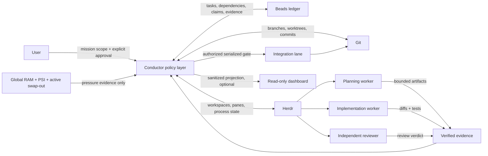

# Conductor

Conductor is a Hermes Agent skill for safely coordinating durable, multi-step software missions across multiple workers, Git worktrees, reviews, and integration gates.

It is a thin policy and reconciliation layer—not a coding agent, scheduler, process registry, or replacement for Git. Delegated mode bundles a transparent idle wake guard; it does not schedule or mutate mission state.

## Intended use

Use Conductor when software work has several dependent units and benefits from:

- parallel workers in isolated worktrees;
- durable task state across interruptions;
- risk-proportional planning, implementation, and review;
- evidence-backed completion and fail-closed integration;
- recovery from stale workers or restarted sessions;
- explicit human approval, push, release, and destructive-operation boundaries.

Do **not** use it for a single bounded edit, an unapproved strategy discussion, or as a generic non-software task queue.

## Architecture



The governing loop is:

```text
reconcile → select ready work → admit resources → dispatch
          → inspect evidence → review/fix → integrate → advance
```

### Source of truth

| Component | Owns |
|---|---|
| Conductor | Approval envelope, risk routing, resource admission, sequencing, evidence reconciliation, recovery, integration authorization, final acceptance |
| Beads (`bd`) | Mission/task state, dependencies, atomic claims, metadata, merge slot, recovery history |
| Herdr | Human-visible workspaces, panes, worker processes, terminal evidence, worktree placement |
| Git | Branches, worktrees, commits, integration history, remote parity |
| Workers | Bounded planning, implementation, testing, and independent review |

## Dependencies

### Required

- Linux
- [Hermes Agent](https://hermes-agent.nousresearch.com/docs) with skill loading enabled
- Python 3.10+; helper scripts use only the standard library
- Git
- Beads CLI available as `bd`
- Herdr CLI available as `herdr`

### Operational companions

These are referenced by the policy and should be installed/configured when their routes are used:

- Hermes `subagent-roles` skill for role-specific worker/model routing
- Hermes `requesting-code-review` skill for independent review workflows
- Hermes `test-driven-development` skill for RED/GREEN implementation routes
- Hermes `kanban-orchestrator` skill for tier-1 transition-sweep checkups
- Hermes `external-agent-review-loops` skill for tier-2 integrated-base health checkups
- credentials and model providers required by the chosen worker roles
- an optional sanitized dashboard project when `dashboard.enabled` is true

Conductor does not bundle Beads, Herdr, model credentials, or a dashboard host. It bundles `scripts/controller_idle_watchdog.py`, a timer-based wake transport for a dedicated delegated controller. The guard does not schedule, claim work, edit Beads/Git, run tests, or replace the controller.

## Install

Clone directly into the Hermes skill directory:

```bash
mkdir -p ~/.hermes/skills/autonomous-ai-agents
git clone https://github.com/lpbangun/conductor-skill.git \
  ~/.hermes/skills/autonomous-ai-agents/conductor
```

Confirm required commands:

```bash
command -v hermes git python3 bd herdr
```

## Use

Start guided intake in an interactive Hermes session:

```text
/conductor
```

Or provide an initial mission proposal:

```text
/conductor Implement feature X in ~/projects/myapp. Checkpointed; allow local integration into main; do not push.
```

The first turn performs intake and produces a Mission Contract Preview. It does **not** launch work. Activation requires a later, exact approval:

```text
Approve mission
```

For noninteractive Hermes, preload the skill rather than relying on slash dispatch:

```bash
hermes -s conductor chat -q \
  "Implement feature X in ~/projects/myapp. Begin intake only."
```

Without a live dedicated controller pane, execution is session-orchestrated. Beads, Herdr, and Git preserve recovery state across interruptions, but after restarting the controller you must run `/conductor resume`. Delegated mode keeps one tracked idle watchdog for that pane plus one completion watcher per worker so ordinary checkpoint finals and worker exits wake the controller promptly.

## Safety model

Conductor defaults to:

- no launch before explicit approval;
- no push, release, deploy, destructive cleanup, or credential change without exact authority;
- one mutating owner per worktree;
- plan-declared parallel lanes remain separate Beads instead of being collapsed into one serial task;
- at least two productive workers are targeted whenever two dependency-ready, non-overlapping lanes fit the approved resource envelope;
- workload-weighted capacity (`maxWeightedSlots` with `light`/`standard`/`heavy` classes) plus an emergency mission-owned process ceiling (`maxWorkers` 1–6) that is not proof of capacity;
- fail-closed admission using available RAM reserves, memory PSI, and active swap-out rate;
- independent review for Standard and Critical work;
- serialized merges, pushes, and broad test suites; focused tests may overlap independent work and do not consume broad-suite budget;
- integration executed by Droid only, after its review fix pass — the conductor authorizes the lane but never commits or merges;
- evidence inspection rather than worker self-report;
- preservation of branches and worktrees during ambiguous recovery.

Conductor re-samples global pressure before each worker-consuming action and admits the next workload only when weighted capacity, class reserve, emergency process ceiling, and pressure signals are safe. Unrelated workloads affect admission naturally. It does not inspect, stop, or manage those unrelated processes. Cumulative swap occupancy is retained as telemetry only because swapped pages can remain resident after pressure ends; occupancy alone never blocks workspace opening or dispatch.

See `SKILL.md` for the complete policy, `references/mission-contract.md` for the mission schema, and `references/resource-admission-validation.md` for policy-boundary vs operational qualification.

## Controller admission

The controller admission evaluation policy in `references/controller-admission-evidence.md` applies when a deterministic controller or safety-bearing runtime is materially changed. The bundled idle watchdog has wake-only authority and must pass its focused tests plus a disposable live-Herdr canary before delegated use.

## Verify

```bash
python3 scripts/test_contract.py -v
python3 scripts/test_invocation_contract.py -v
python3 scripts/test_scheduler_liveness.py -v
python3 scripts/test_controller_watchdog.py -v
python3 scripts/test_dispatch_worker.py -v
python3 scripts/smoke_test.py
python3 -m py_compile scripts/*.py
```

The smoke test creates only a disposable temporary Git/Beads repository.

## Repository layout

```text
.
├── SKILL.md                       # Main Hermes skill and operating policy
├── references/                    # Mission, evidence, recovery, scheduling, and admission contracts
├── templates/                     # Mission intake, metadata, and worker brief templates
└── scripts/                       # Validators, scheduler/wake helpers, tests, and Beads smoke test
```

## License

MIT
